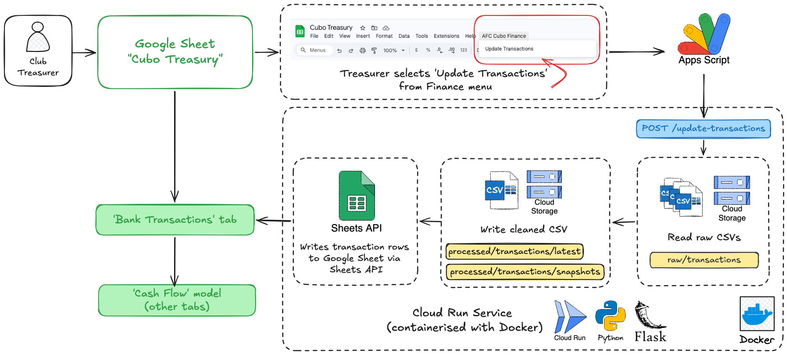
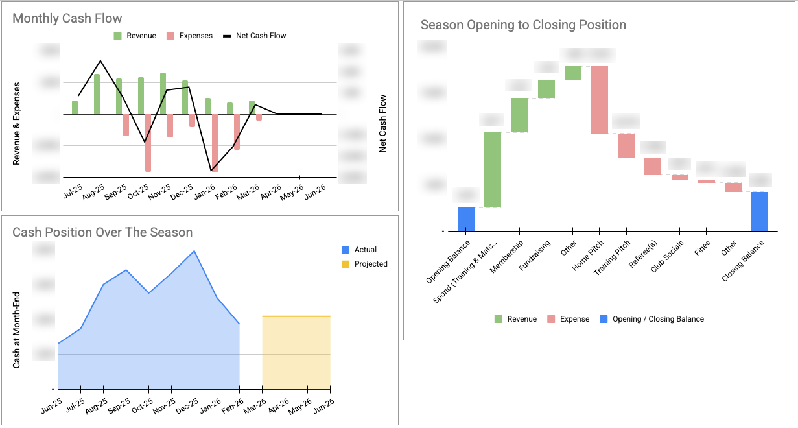

# AFC Cubo Finance Automation

**Author:** Samuel Harrison — Club Treasurer & Goalkeeper, AFC Cubo (2025/26 season)

---

## Background

**AFC Cubo** is an amateur grassroots football club competing in the **Surrey County Premier League** (Step 7 of the English Football Pyramid). The club has around 50 active players across two squads and celebrated its **25th anniversary** in 2025.

Like many grassroots clubs, Cubo relies entirely on volunteers. The treasurer role — responsible for tracking income, expenses, and the club's overall financial health — changes hands most seasons. In practice, this has meant inconsistent records, limited visibility of cash flow during the season, and uncertainty about whether the club is operating sustainably.

Rising costs, particularly pitch hire following a move to a new home ground, made it clear that a more structured approach was needed. As the current treasurer, I built this system to give the club **clear financial visibility throughout the season** and to leave behind something any future treasurer can pick up and use with minimal friction.

---

## What It Does

The system automates one of the repetitive parts of treasurer work: taking raw bank transaction exports and turning them into a structured, categorised financial model.

At the click of a button in **Google Sheets**, the pipeline:

1. Reads all raw transaction CSVs uploaded to **Google Cloud Storage**
2. Cleans, validates, and deduplicates transactions using a **Python/Flask** service running on **Google Cloud Run** (containerised with **Docker**)
3. Writes the cleaned dataset back to Cloud Storage — both a latest version and a timestamped snapshot
4. Pushes the transactions into the *Bank Transactions'* tab in **Google Sheets**, preserving any categories the treasurer has already assigned
5. The categorised transactions feed automatically into a **cash flow model**, showing actuals month-by-month and projecting the club's cash position through to the end of the season

The button is run by by **Google Apps Script** (cloud-based JavaScript platform), which sends a `POST /update-transactions` request to the Cloud Run endpoint.

---

## Architecture

<em>Figure 1: To operate the system, the treasurer first uploads the latest bank transaction CSV exports to Google Cloud Storage. From there, clicking <strong>'Update Transactions'</strong> in Google Sheets triggers an Apps Script that calls the Cloud Run service, which reads the raw CSVs, cleans and deduplicates the data, writes the results back to Cloud Storage, before pushing the transaction rows directly into the sheet.</em>

---

## Output

<em>Figure 2: Example outputs from the cash flow model. Sensitive financial figures have been blurred.</em>

---

## Design Principles

The architecture prioritises simplicity and long-term maintainability:

- **Google Sheets** keeps the financial model accessible; any future treasurer comfortable with basic spreadsheets can use and maintain it
- **Cloud Run** keeps all processing logic in one place, versioned, and straightforward to redeploy
- **Cloud Storage** provides an immutable audit trail of raw bank transaction CSV exports, with timestamped snapshots for recovery
- The pipeline runs entirely on demand with no scheduled jobs or extra moving parts

---

## Tech Stack

| Component | Technology |
|---|---|
| Data processing | [Python](main.py), [Flask](main.py) |
| Container | [Docker](Dockerfile) |
| Cloud hosting | Google Cloud Run |
| Data storage | Google Cloud Storage |
| Trigger | Google Apps Script |
| Financial model & reporting | Google Sheets |
